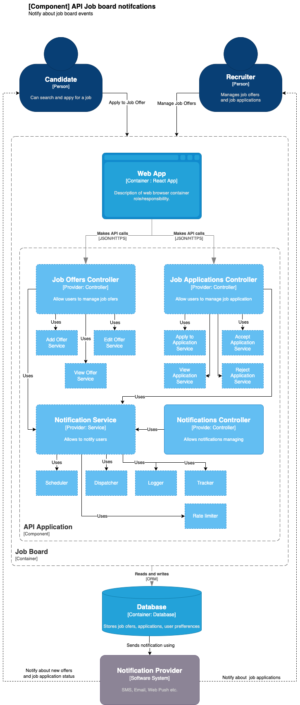

# Notifications

Example implementation of the Notifications API

## Description
Implementation of the Notifications API:
* [GET] `/notifications`
* [POST] `/notifications`

## Architecture 

    

